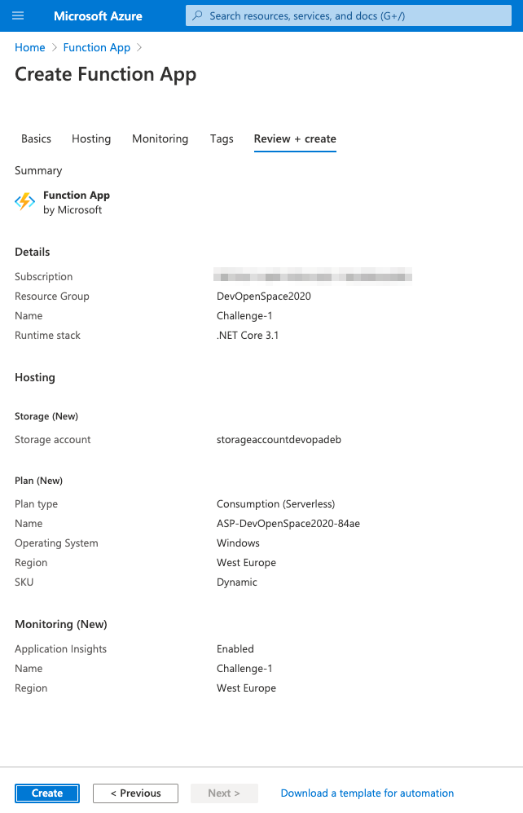
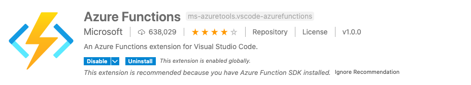
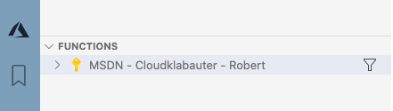

# Hints for Challenge 1 - Create and deploy your first Azure Function

_Table of Content_:

- [Hints for Challenge 1 - Create and deploy your first Azure Function](#hints-for-challenge-1---create-and-deploy-your-first-azure-function)
  - [Create Function App in the Azure Portal](#create-function-app-in-the-azure-portal)
  - [Install the Azure Functions extension in VSCode](#install-the-azure-functions-extension-in-vscode)
  - [Create an Azure Function Project in VSCode](#create-an-azure-function-project-in-vscode)
  - [Implement the Function with an HTTP Trigger](#implement-the-function-with-an-http-trigger)
    - [BONUS - Provide HttpClientFactory via Dependency Injection](#bonus---provide-httpclientfactory-via-dependency-injection)
  - [Deploy the Function App to Azure](#deploy-the-function-app-to-azure)
  - [Test with Postman or cURL](#test-with-postman-or-curl)

## Create Function App in the Azure Portal

[Create a function app from the Azure portal
](https://docs.microsoft.com/en-us/azure/azure-functions/functions-create-function-app-portal)

In the link, you will find instructions on how to create a Function App in Azure Portal. Please stick to the following parameters:

- Resource Group: Select the resource group we assign to you
- Function App Name: Can be freely chosen.
- Publish: Code
- Runtime: .NET Core
- Version: 3.1
- Region: West Europe
- Operating System: Windows
- Plan: Consumption (Serverless)

It should look like this at the end:



## Install the Azure Functions extension in VSCode

Go to the extensions of Visual Studio Code and install the "Azure Functions" extension. You can find it on [here](https://marketplace.visualstudio.com/items?itemName=ms-azuretools.vscode-azurefunctions)



Now you have a new menu icon link in VSCode (it looks like the Azure icon). Click on it and
make sure that your subscription has been selected.



## Create an Azure Function Project in VSCode

Create an empty directory using Powershell/Terminal. Open VSCode with the command `code .`

In VSCode go to the Azure Functions area (Azure Icon) via the left menu. How to create the Function Project can be found under the following link:

[Create a function in Azure using Visual Studio Code
](https://docs.microsoft.com/en-us/azure/azure-functions/functions-create-first-function-vs-code?pivots=programming-language-csharp)

Please observe the following guidelines:

- Language: C#
- First Function: HTTP Trigger
- Function Name: GetMeasurementsFunction
- Authorization Level: Function

Alternative (Terminal)
```bash
func init GetMeasurementsFunction --dotnet
cd GetMeasurementsFunction
func new --name GetMeasurementsFunction --template "Http Trigger"
```

## Implement the Function with an HTTP Trigger

This is my solution to retrieve the Netatmo readings in the Azure Function

You have to install the following NuGet packages (<kbd>CTRL</kbd> + <kbd>SHIFT</kbd> + <kbd>P</kbd>):

- Microsoft.Azure.Functions.Extensions - `Version="1.1.0"`
- Microsoft.Extensions.Http - `Version="3.1.9"`
- System.Text.Json - `Version="4.7.2`

```csharp
//GetMeasurementsFunction.cs

namespace ServerlessWorkshop.Challenge1
{
    public class GetMeasurementsFunction
    {
        private static HttpClient httpClient = new HttpClient();

        [FunctionName("GetMeasurementsFunction")]
        public static async Task<IActionResult> Run(
            [HttpTrigger(AuthorizationLevel.Function, "get", "post", Route = null)] HttpRequest req,
            ILogger log)
        {
            var response = await httpClient.GetAsync("https://emulatorfunctionapp98f3eeca.azurewebsites.net/api/getstationdata?device_Id=70:ee:50:1b:26:ac&code=K3fQDcXMFOSPKGV1DM8JCzvmtyQtx6C4CG4Ba6Xe1rpN9higlU5S3Q==");

            if (response.IsSuccessStatusCode)
            {
                await using var responseStream = await response.Content.ReadAsStreamAsync();
                var measurements = await JsonSerializer.DeserializeAsync<StationDataModel>(responseStream);

                return new OkObjectResult(measurements);
            }
            else
            {
                var errorMessage = $"Netatmo API call failed. Reason: {response.StatusCode}";
                log.LogError(errorMessage);
                return new BadRequestErrorMessageResult(errorMessage);
            }
        }
    }
}
```

The used DTO classes have the following format:

```csharp
namespace ServerlessWorkshop.Challenge1
{
    public class StationDataModel
    {
        [JsonPropertyName("id")]
        public string Id { get; set; }

        [JsonPropertyName("name")]
        public string Name { get; set; }

        [JsonPropertyName("time")]
        public DateTimeOffset Time { get; set; }

        [JsonPropertyName("stationModules")]
        public IList<StationModuleModel> StationModules { get; set; }
    }

    public class StationModuleModel
    {
        [JsonPropertyName("id")]
        public string Id { get; set; }

        [JsonPropertyName("name")]
        public string Name { get; set; }

        [JsonPropertyName("time")]
        public DateTimeOffset Time { get; set; }

        [JsonPropertyName("temperature")]
        public double Temperature { get; set; }

        [JsonPropertyName("co2")]
        public int Co2 { get; set; }

        [JsonPropertyName("humidity")]
        public int Humidity { get; set; }
    }
}
```

### BONUS - Provide HttpClientFactory via Dependency Injection

You can provide the 'IHttpClientFactory' via dependency injection. For this purpose you create a `Startup.cs` with the following content and install the following NuGet Dependencies:

```bash
dotnet add package Microsoft.Azure.Functions.Extensions
dotnet add package Microsoft.Extensions.Http
```

```csharp
// Startup.cs
using Microsoft.Azure.Functions.Extensions.DependencyInjection;
using Microsoft.Extensions.DependencyInjection;

[assembly: FunctionsStartup(typeof(ServerlessWorkshop.Challenge1.Startup))]
namespace ServerlessWorkshop.Challenge1
{
    public class Startup : FunctionsStartup
    {
        public override void Configure(IFunctionsHostBuilder builder)
        {
            builder.Services.AddHttpClient();
        }
    }
}
```

In the function itself, the 'IHttpClientFactory' can now be injected via the structure.

```csharp
private readonly IHttpClientFactory _httpClientFactory;

public GetMeasurementsFunction(IHttpClientFactory httpClientFactory)
{
    _httpClientFactory = httpClientFactory;
}

[FunctionName("GetMeasurementsFunction")]
        public async Task<IActionResult> Run(
            [HttpTrigger(AuthorizationLevel.Function, "get", "post", Route = null)] HttpRequest req,
            ILogger log)
{
    // ...
    var requestUri = "https://emulatorfunctionapp98f3eeca.azurewebsites.net/api/getstationdata?device_Id=70:ee:50:1b:26:ac&code=K3fQDcXMFOSPKGV1DM8JCzvmtyQtx6C4CG4Ba6Xe1rpN9higlU5S3Q==";
    var request = new HttpRequestMessage(HttpMethod.Get, requestUri);

    var client = _httpClientFactory.CreateClient();
    var response = await client.SendAsync(request);
    // ...
}
```

More information about Dependency Injection in Azure Functions can be found at the following link:

[Use dependency injection in .NET Azure Functions](https://docs.microsoft.com/en-us/azure/azure-functions/functions-dotnet-dependency-injection)  
[Make HTTP requests using IHttpClientFactory in ASP.NET Core](https://docs.microsoft.com/en-us/aspnet/core/fundamentals/http-requests?view=aspnetcore-3.1)

To execute the implemented function, just press **F5** in VSCode. Alternatively, you can go into the project directory via Terminal/Powershell and start the Function Host with the following command

```bash
func host start --port 8001
```

If there are still problems, you can find a finished implementation in the Final Folder.

## Deploy the Function App to Azure

We also use VSCode to provide the function in Azure. It describes very well how this works exactly under the following link.

[Publish the project to Azure](https://docs.microsoft.com/en-us/azure/azure-functions/create-first-function-vs-code-csharp#publish-the-project-to-azure)

## Test with Postman or cURL

If your Function Project has been started successfully, you can test your function with the following CURL command or via Postman. Do not forget to pass the DeviceID.

```bash
curl --location --request GET 'http://localhost:8001/api/GetMeasurementsFunction?device_id=70:ee:50:1b:26:ac'
```
