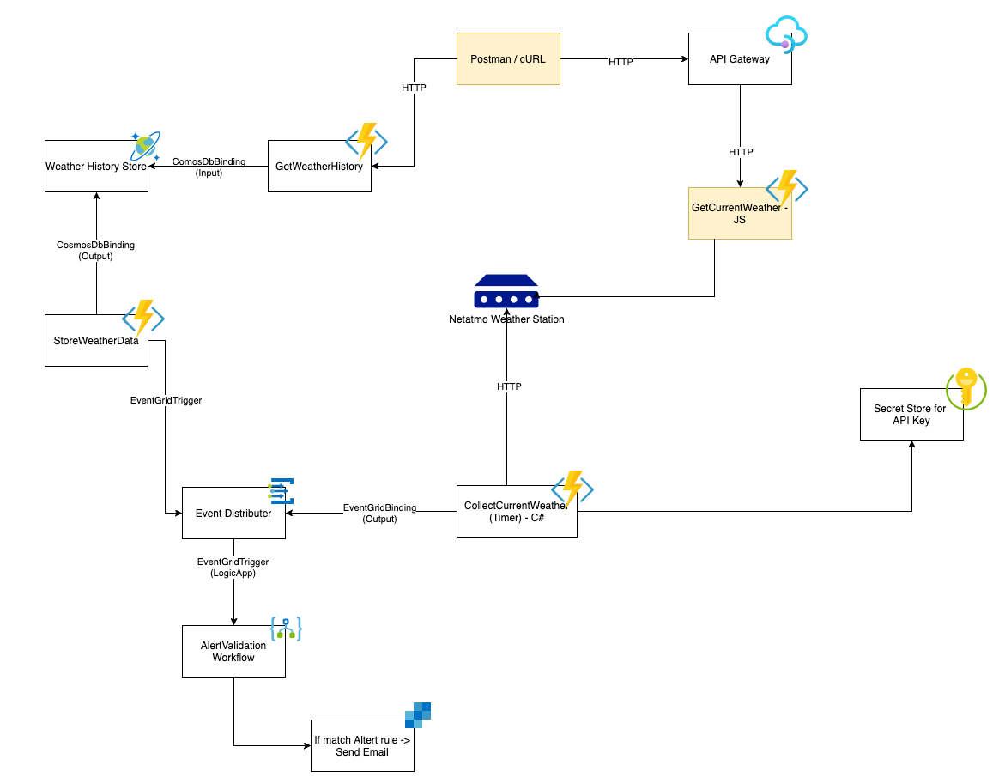

# Challenge 1 - Create and deploy your first Azure Function

We have a Netatmo weather station emulator (Device-ID '70:ee:50:1b:26:ac') for you. The weather station generates new measurements every minute. The measured values are provided by Netatmo via REST API.

You should write a function that can be called via HTTP and that retrieves the latest measured data from the Netatmo REST API Endpoint.

## ⚠️ Challenge

- Create an Azure Function App with a Consumption Plan in the Azure Portal
- Create an Azure Function Project with VSCode
- Create an Azure Function with an HTTP trigger
- Call the Netatmo REST API to retrieve the current measurement values
- Integrate the new HTTP function into the portal and check if the data is displayed correctly.

### Netatmo REST API

Über diesen Endpoint könnt ihr die aktuellen Messwerte abfragen:

`https://f50fde8bbb1ea0874e23b254e6e2ba44.m.pipedream.net`

## 💡 Success Criteria

You have created an Azure Function App via the portal and provided your first function with an HTTP trigger. The function should be called successfully via Postman or curl and return the data of the measuring station.

## ℹ️ References

- [Create a function app from the Azure portal
  ](https://docs.microsoft.com/en-us/azure/azure-functions/functions-create-function-app-portal)
- [Create a function in Azure using Visual Studio Code
  ](https://docs.microsoft.com/en-us/azure/azure-functions/functions-create-first-function-vs-code?pivots=programming-language-csharp)
- [Use dependency injection in .NET Azure Functions](https://docs.microsoft.com/en-us/azure/azure-functions/functions-dotnet-dependency-injection)
- [Make HTTP requests using IHttpClientFactory in ASP.NET Core](https://docs.microsoft.com/en-us/aspnet/core/fundamentals/http-requests?view=aspnetcore-3.1)

## ✔️ Next Challenge

In the next challenge, you will use a timer function to retrieve the measurements regularly from the Netatmo API and send them to an EventGrid.
