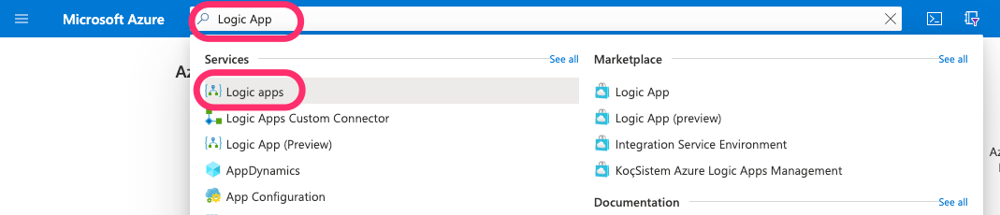
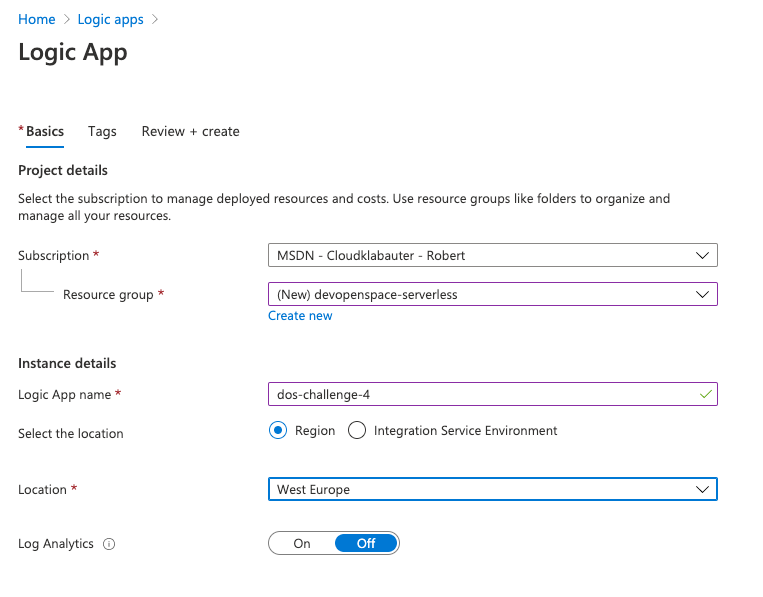
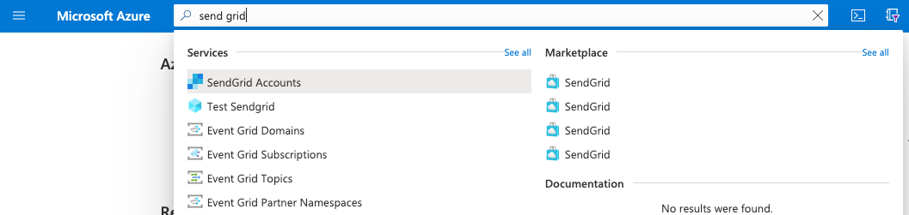
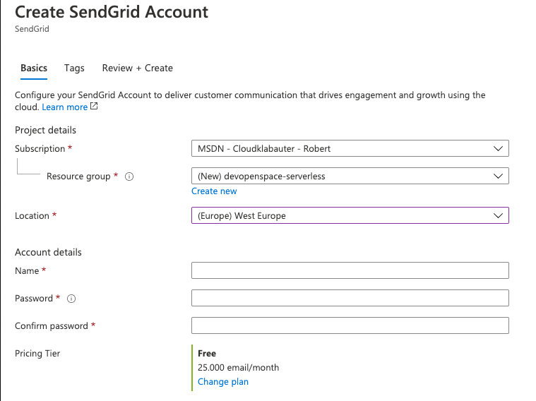
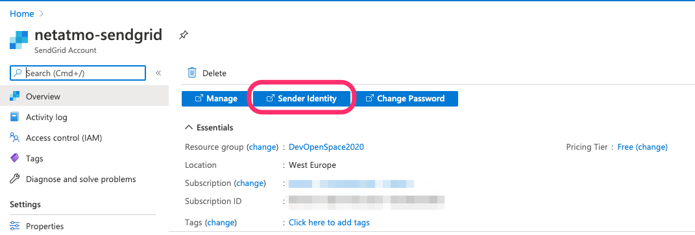
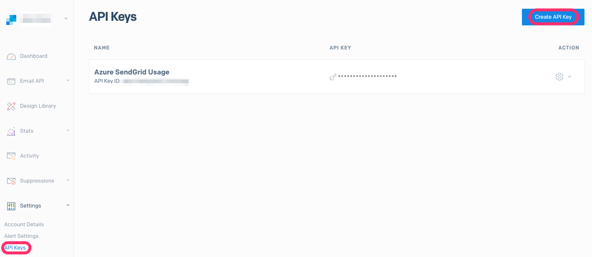
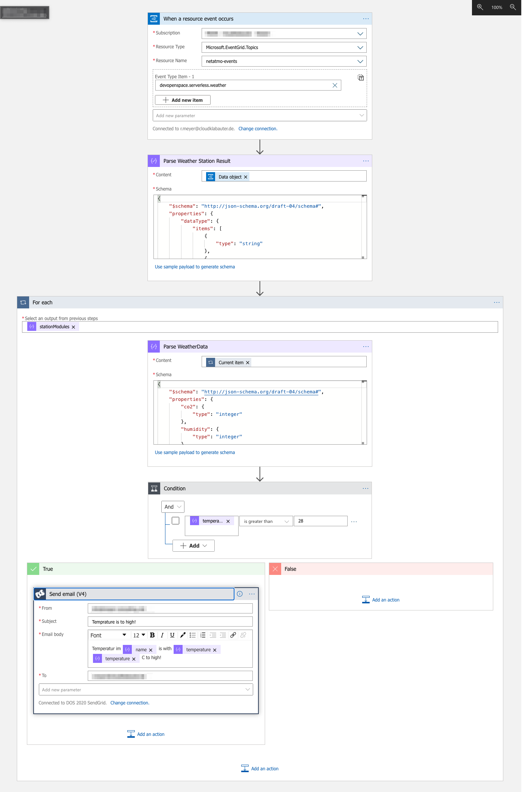
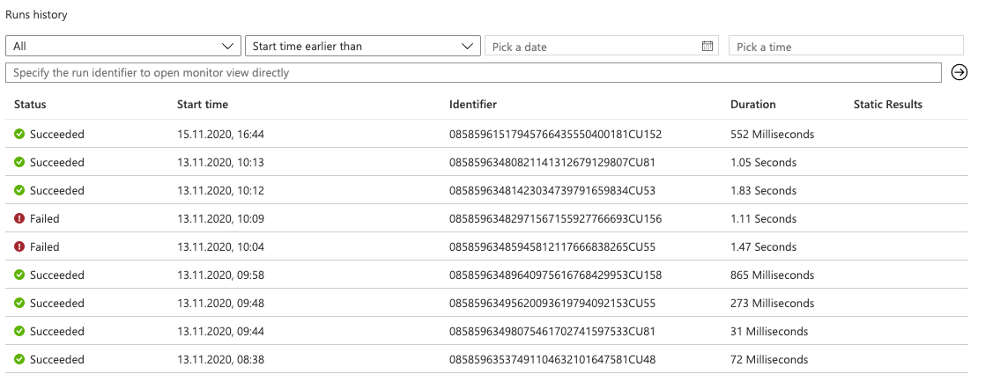

# Hints for Challenge 4 - Create a LogicApp to receive events and send alert Emails.

_Table of Content_:

- [Pre-Step: Create a Function to send a event to EventGrid](#-heavy-exclamation-mark--pre-step--create-a-function-to-send-a-event-to-eventgrid)
  - [Provision Azure EventGrid & Function App](#provision-azure-eventgrid---function-app)
    - [**Hint Storage Account:**](#--hint-storage-account---)
    - [**Hint Azure Function App**](#--hint-azure-function-app--)
  - [Create an Azure Function to send a measurement result to the EventGrid](#create-an-azure-function-to-send-a-measurement-result-to-the-eventgrid)
- [Creating an Azure Logic App with the Azure Portal](#creating-an-azure-logic-app-with-the-azure-portal)
- [Create a Azure SendGrid Account](#create-a-azure-sendgrid-account)
- [Defining the workflow](#defining-the-workflow)

## :heavy_exclamation_mark: Pre-Step: Create a Function to send a event to EventGrid

If you were unable to complete Challenge 2, you can use this pre-step to get a start on this exercise. If you have successfully completed Challenge 2, you can build on this and skip this pre-step.

### Provision Azure EventGrid & Function App

An event grid topic provides an endpoint where the source sends events. The publisher creates the event grid topic, subscribers decide which topics to subscribe to. To create a new Azure EventGrid Topic, run the following command:

```bash
RESOURCEGROUP=devopenspace-serverless
TOPICNAME=weather-data
LOCATION=GermanyWestCentral

az eventgrid topic create -g $RESOURCEGROUP --name $TOPICNAME -l $LOCATION
```

#### **Hint Storage Account:**

Create a general-purpose storage account in your resource group and region by using the az storage account create command. In the following example, replace `<STORAGENAME>` with a globally unique name appropriate to you. Names must contain three to 24 characters numbers and lowercase letters only.

#### **Hint Azure Function App**

You can create the function app using the az functionapp create command.

In the following example, replace `<APP_NAME>` with a globally unique name appropriate to you. The `<APP_NAME>` is also the default DNS domain for the function app.

```bash
STORAGENAME=<STORAGENAME>

az storage account create \
  --name $STORAGENAME \
  --location $LOCATION \
  --resource-group $RESOURCEGROUP \
  --sku Standard_LRS

FUNCTIONAPPNAME=<APP_NAME>

az functionapp create \
  --name $FUNCTIONAPPNAME \
  --storage-account $STORAGENAME \
  --consumption-plan-location $LOCATION \
  --resource-group $RESOURCEGROUP \
  --functions-version 3
```

You should now have created an Azure EventGrid and an Azure Function. Check this with the help of the Azure Portal.

### Create an Azure Function to send a measurement result to the EventGrid

We now create an Azure Function with an HTTP trigger. With this function, we manually send a measurement result from the Netatmo API to the Azure EventGrid. The LogicApp will consume this later.

```bash
func init CollectCurrentWeather --dotnet

cd CollectCurrentWeather

func new --name EventCollector --template "Http trigger"

TOPICKEY=$(az eventgrid topic key list --name $TOPICNAME --resource-group $RESOURCEGROUP --query "key1" --output tsv)
TOPICURL=$(az eventgrid topic show --name $TOPICNAME -g $RESOURCEGROUP --query "endpoint" --output tsv)

func settings add WeatherDataTopicKey $TOPICKEY
func settings add WeatherDataTopicUri $TOPICURL

dotnet add package Microsoft.Azure.WebJobs.Extensions.EventGrid
```

```csharp
// EventCollector.cs

public static class EventCollector
{
    private static HttpClient httpClient = new HttpClient();

    [FunctionName("EventCollector")]
    [return: EventGrid(TopicEndpointUri = "WeatherDataTopicUri", TopicKeySetting = "WeatherDataTopicKey")]
    public static async Task<EventGridEvent> Run(
        [HttpTrigger(AuthorizationLevel.Function, "get", "post", Route = null)] HttpRequest req,
        ILogger log)
    {
        var response = await httpClient.GetAsync("https://emulatorfunctionapp98f3eeca.azurewebsites.net/api/getstationdata?device_Id=70:ee:50:1b:26:ac&code=K3fQDcXMFOSPKGV1DM8JCzvmtyQtx6C4CG4Ba6Xe1rpN9higlU5S3Q==");
        return new EventGridEvent(Guid.NewGuid().ToString(), "wheather", await response.Content.ReadAsStringAsync(), "devopenspace.serverless.weather", DateTime.UtcNow, "1.0");
    }
}
```

Jetzt können wir die Function App starten und die Function z.B. im Browser aufrufen. Pro Aufruf wird ein Event an das EventGrid übergeben.

```bash
func host start --port 8001
```

## Creating an Azure Logic App with the Azure Portal

We create a new Azure Logic app using the search bar in the Azure Portal



Create the Logic App in the same resource group where your EventGrid is located. As for the location, we select **Region** here. The Geo-Location should be **West Europe**. You can choose the name as you like.



More information about creating an Azure Logic App can be found here: [Quickstart: Create your first Logic Apps workflow - Azure portal](https://docs.microsoft.com/en-us/azure/logic-apps/quickstart-create-first-logic-app-workflow)

## Create an Azure SendGrid Account

To create an Azure SendGrid account, go to the Azure Portal and use the global search to create an Azure SendGrid account:



Here you select **devopenspace-serverless** as resource group again. The location should be **West Europe**. Account details like name and password you to choose. As Pricing Tier you choose **Free** here. You have to enter the contact details individually. Then click on **Create**.



Last but not least you have to create a Sender Identity, which you want to use to send your emails later. To do so, open your newly created SendGrid account in the Azure Portal and click on **Sender Identity**. You will now be redirected to an external configuration page of SendGrid.



Under **Sender Authentication** you can create a new sender. There you enter your personal data and the email address from which you want to send emails.

Under the menu item **API Keys** in the SendGrid Console you can create a new API Key, which you will need later to send an email via the Logic App.



More information about creating an Azure SendGrid Account can be found here: [How to Send Email Using SendGrid with Azure](https://docs.microsoft.com/en-us/azure/sendgrid-dotnet-how-to-send-email)

## Defining the workflow

We define the workflow with the following steps:

1. **EventGrid: Event Occurs Trigger**: With this trigger, we react to new events in the EventGrid
2. **JSON Parse Action**: We parse the CloudEvent in with [this](./Final/02_LogicApp_Definition/schemas/01_CloudEvent_Schema.json) schema to a usable JSON object
3. **ForEach Action**: We iterate through all measurement results of the current measurement.
   1. **JSON Parse Action**: Within the ForEach, we have to parse each measurement result into a valid JSON object again. For this, we use the [this](./Final/02_LogicApp_Definition/schemas/02_Measurement_Schema.json) scheme.
   2. **Condition Action**: With the Condition Action we can react to measured values outside our tolerances (e.g. temperature > 26 degrees)
      1. **SendGrid: Send Mail Action**: If the condition applies, we will send an email to us via SendGrid.

In the end, the workflow should look like this.



If we now send a new measurement result to the EventGrid, the workflow should be triggered. You can see the workflow execution on the start page of your Logic App in the Azure Portal.


