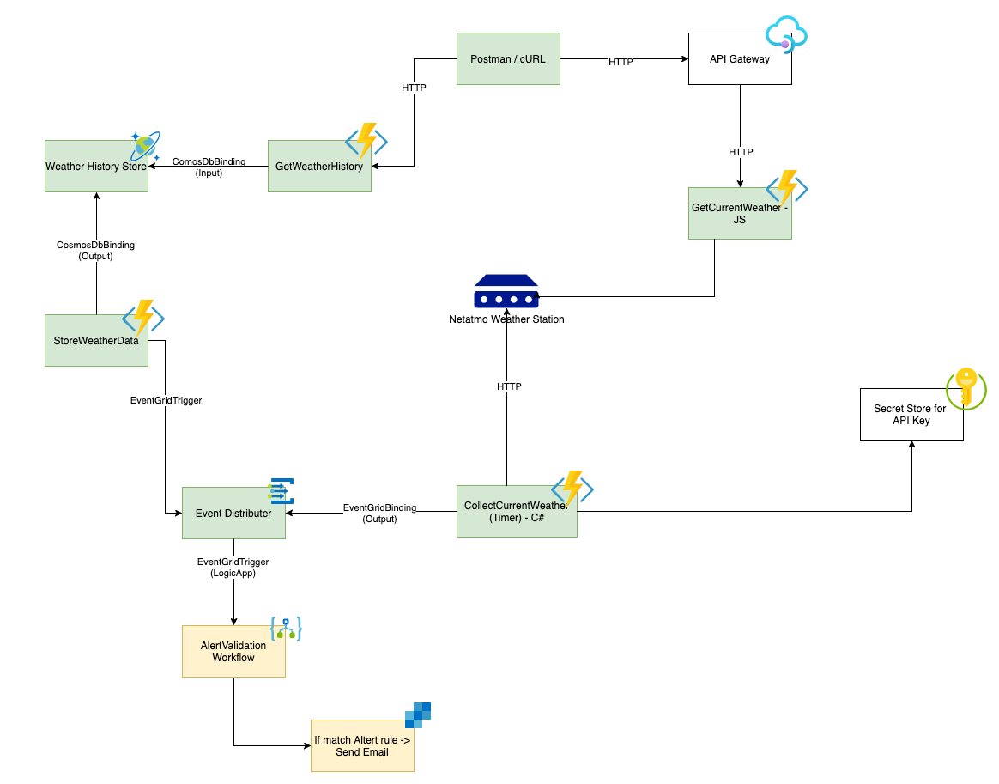

# Challenge 4 - Create a LogicApp to receive events and send alert Emails.

In exercise 2 you used a timer function to query the measured values of the Netatmo station regularly and send them to an EventGrid. In exercise 3 you received the measured values from the EventGrid with an EventGridTrigger and persisted them in a CosmosDB.

Now we will take a closer look at another part of the Azure Serverless world: The Logic Apps. We will create a LogicApp with an EventGrid trigger and subscribe to the events from the same EventGrid from exercise 2 and 3.

If the measured values exceed a limit you set, the Logic App should send you an email. To send the email we will use Azure SendGrid.

### ⚠️ Challenge

- Create a Logic App in the Azure Portal
- Add an EventGrid trigger to the Logic App
- Create a decision tree to send an email at measurements you specify.
- Create an Azure SendGrid in the Azure Portal
- Send the email via the SendGrid Connector from Logic Apps

## 💡 Success Criteria

You should find an email in your inbox if the measured values exceed the values you specified.

## ℹ️ References

- [Quickstart: Create your first Logic Apps workflow - Azure portal](https://docs.microsoft.com/en-us/azure/logic-apps/quickstart-create-first-logic-app-workflow)
- [Azure EventGrid Connector](https://docs.microsoft.com/en-us/connectors/azureeventgrid/)
- [SendGrid Connector](https://docs.microsoft.com/en-us/connectors/sendgrid/)
- [How to Send Email Using SendGrid with Azure](https://docs.microsoft.com/en-us/azure/sendgrid-dotnet-how-to-send-email)

## ✔️ Next Challenge

In the next challenge, we will focus on how you work with and protect sensitive data in Azure Function. We will take a closer look at the Azure KeyVault, Service Identities, etc.
