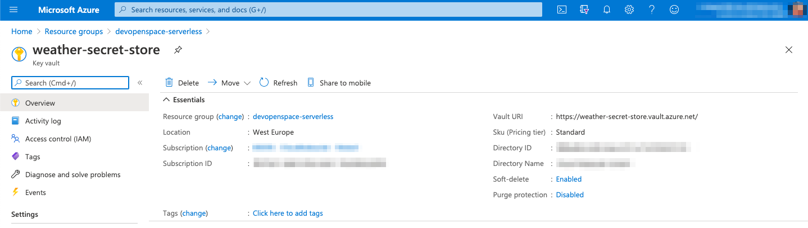
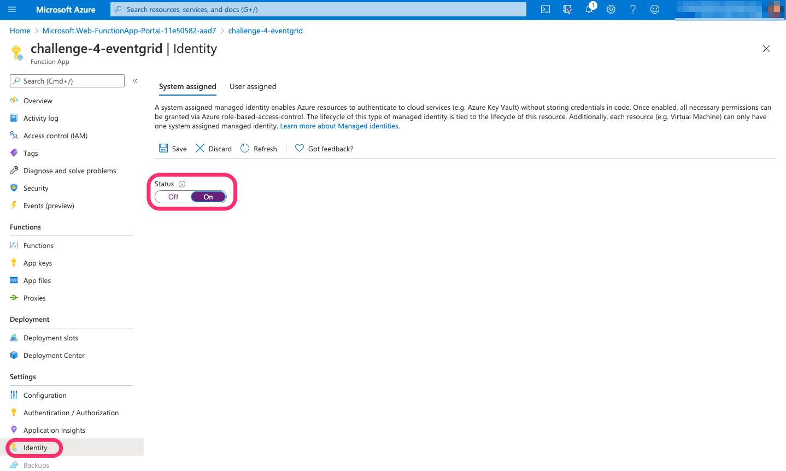
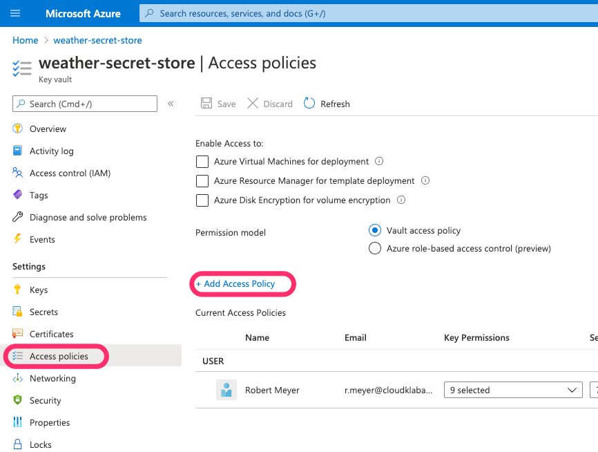
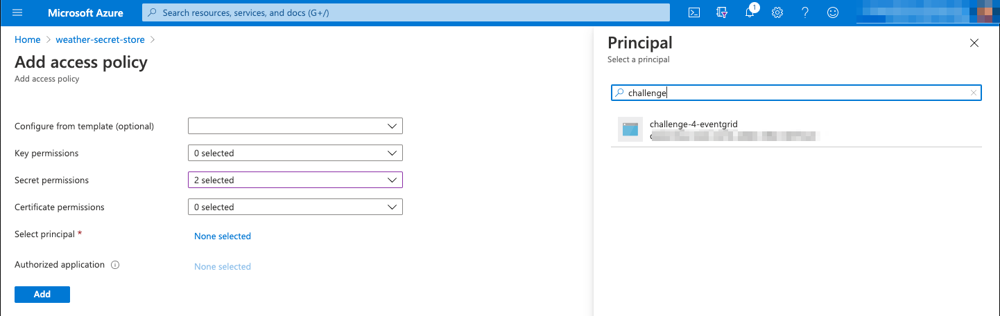
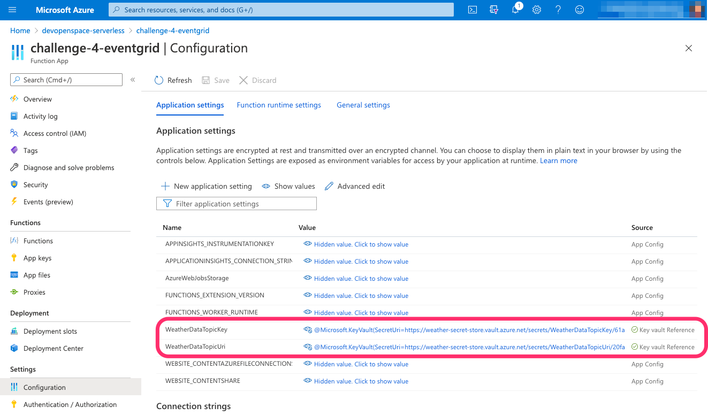
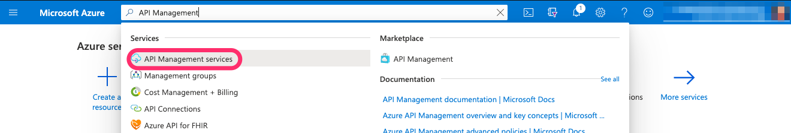
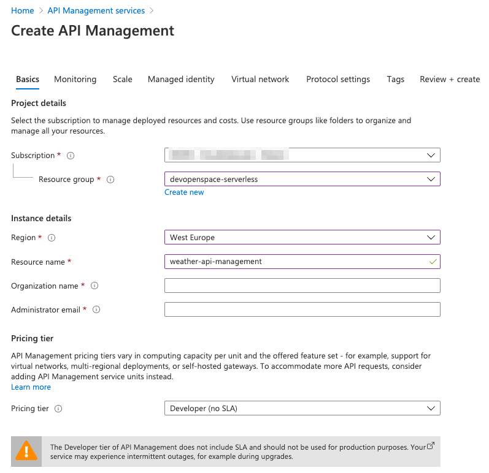
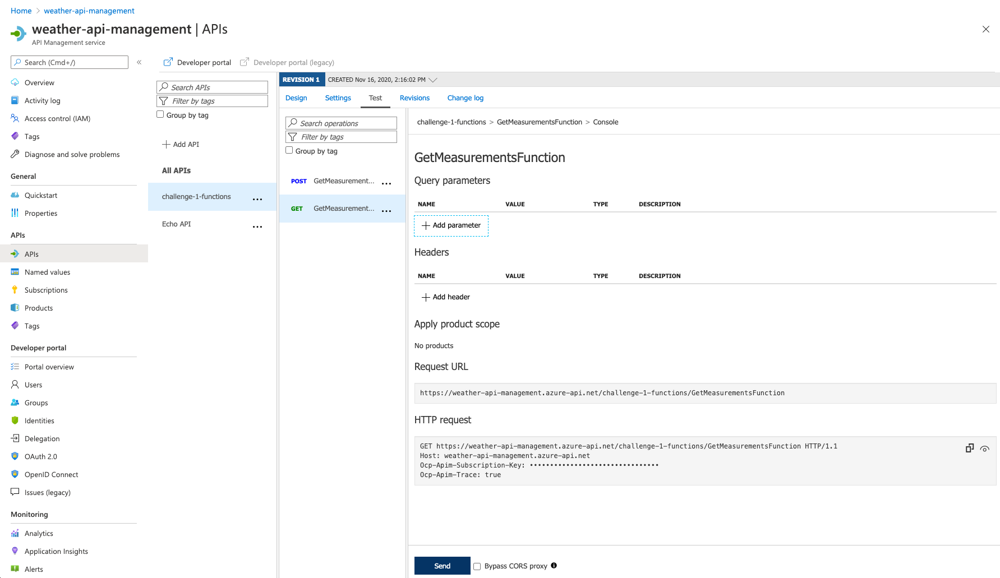
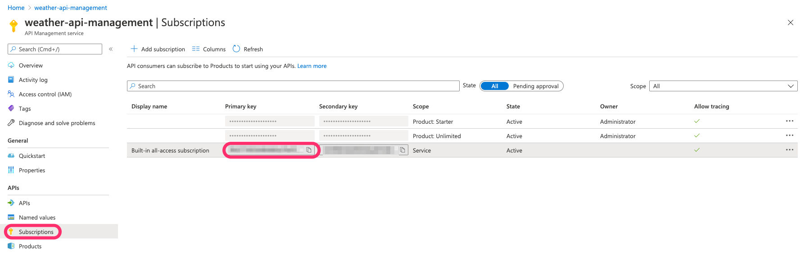

# Hints for Challenge 5 - Secure your Azure Functions with Azure KeyVaults & API Management

_Table of Content_:

- [Create a Azure Key Vault](#create-a-azure-key-vault)
- [Activate the Managed Service Identity in Azure Function App and connect to the KeyVault](#activate-the-managed-service-identity-in-azure-function-app-and-connect-to-the-keyvault)
  - [Activate the Managed Service Identity](#activate-the-managed-service-identity)
  - [Connecting Function App and KeyVault](#connecting-function-app-and-keyvault)
- [Create Secrets in the KeyVault and integrate the Secrets in the Azure Function App](#create-secrets-in-the-keyvault-and-integrate-the-secrets-in-the-azure-function-app)
- [Creating an API Management Service and integrating the Azure Function](#creating-an-api-management-service-and-integrating-the-azure-function)
  - [Create a API Management Service with Azure Portal](#create-a-api-management-service-with-azure-portal)
  - [Determine the Function Url incl. Function Key](#determine-the-function-url-incl-function-key)
  - [Insert Function App in API Management Service](#insert-function-app-in-api-management-service)
  - [Calling the HTTP Function with the API Management Service](#calling-the-http-function-with-the-api-management-service)

## Create an Azure Key Vault

We use the Azure CLI to create an Azure Key Vault in our resource group **devopenspace-serverless**.

```bash
RESOURCEGROUP=devopenspace-serverless
KEYVAULTNAME=weather-secret-store
LOCATION=WestEurope

az keyvault create --name $KEYVAULTNAME --resource-group $RESOURCEGROUP --location $LOCATION
```

In the Azure Portal, you can check if your KeyVault was created successfully.



You can find more information here: [Quickstart: Create a key vault using the Azure CLI](https://docs.microsoft.com/en-us/azure/key-vault/general/quick-create-cli)

## Activate the Managed Service Identity in Azure Function App and connect to the KeyVault

### Activate the Managed Service Identity

In this step, we activate the Managed Service Identity on our Azure Function App. The Managed Service Identity is required to establish a secure authorization between the Azure KeyVault and the Function App.

You can activate this in your FunctionApp in the Azure Portal or via Azure CLI.

Via Azure Portal:


or via Azure CLI:

```bash
FUNCTIONAPPNAME=<NAME_OF_YOUR_FUNCTION_APP_FROM_CHALLENGE_2>

az functionapp identity assign -g $RESOURCEGROUP -n $FUNCTIONAPPNAME
```

### Connecting Function App and KeyVault

We can now connect the Azure Function App to the Azure Key Vault. To do this, we go to the Azure Portal, open our KeyVault and go to the menu item **Access Policies**. There we create an Access Policy for the Managed Identity, which we have just created for the Azure Function App.



We now select the options **Get** and **List** under **Secret Permissions**. Then we click on **Select principal** and search for the name of our Function App from Challenge 2. Select it and create an access policy.



## Create Secrets in the KeyVault and integrate the Secrets in the Azure Function App

In exercise 2 we use two sensitive information in the AppSettings. We now want to store this information in the Azure KeyVault as Secrets. This can be done via the Azure CLI or the Azure Portal.

About the Azure CLI:

```bash
TOPICNAME=weather-data
TOPICKEY=$(az eventgrid topic key list --name $TOPICNAME --resource-group $RESOURCEGROUP --query "key1" --output tsv)
TOPICURL=$(az eventgrid topic show --name $TOPICNAME -g $RESOURCEGROUP --query "endpoint" --output tsv)

az keyvault secret set --vault-name $KEYVAULTNAME --name "WeatherDataTopicKey" --value $TOPICKEY

az keyvault secret set --vault-name $KEYVAULTNAME --name "WeatherDataTopicUri" --value $TOPICURL
```

You can also use Azure CLI to display the secrets you just created:

```bash
az keyvault secret show --name "WeatherDataTopicKey" --vault-name $KEYVAULTNAME
az keyvault secret show --name "WeatherDataTopicUri" --vault-name $KEYVAULTNAME
```

Now we just have to find out the `id` of the respective secret and insert it in the following format `@Microsoft.KeyVault(SecretUri=<the_uri_of_the_secret_including_the_version>)` instead of the sensitive data in the App Settings of our Function App.

We can do this using the following script with the Azure CLI:

```bash
TOPICKEY_SECRET_ID="$(az keyvault secret show --name "WeatherDataTopicKey" --vault-name $KEYVAULTNAME --query id)"
TOPICKEY_SECRET_ID="${TOPICKEY_SECRET_ID%\"}"
TOPICKEY_SECRET_ID="${TOPICKEY_SECRET_ID#\"}"

TOPICURL_SECRET_ID="$(az keyvault secret show --name "WeatherDataTopicUri" --vault-name $KEYVAULTNAME --query id)"
TOPICURL_SECRET_ID="${TOPICURL_SECRET_ID%\"}"
TOPICURL_SECRET_ID="${TOPICURL_SECRET_ID#\"}"

TOPICKEY_SECRET_REF="@Microsoft.KeyVault(SecretUri=$TOPICKEY_SECRET_ID)"
TOPICURL_SECRET_REF="@Microsoft.KeyVault(SecretUri=$TOPICURL_SECRET_ID)"

az functionapp config appsettings set -g $RESOURCEGROUP -n $FUNCTIONAPPNAME --settings WeatherDataTopicKey=$TOPICKEY_SECRET_REF

az functionapp config appsettings set -g $RESOURCEGROUP -n $FUNCTIONAPPNAME --settings WeatherDataTopicUri=$TOPICURL_SECRET_REF
```

If you now look in the Azure Portal in your Function App from exercise 2, you should see your references to the KeyVault under **Configuration** -> **Application Settings** and not the direct value. If the green hack is a red X, this may have the following reasons:

- Managed Service Identity was not created correctly
- The Function App was not authorized in the Key Vault
- The format of the Ref link in the Application Settings is wrong



More information about creating secrets with the Azure CLI can be found here: [Quickstart: Set and retrieve a secret from Azure Key Vault using Azure CLI](https://docs.microsoft.com/en-us/azure/key-vault/secrets/quick-create-cli)

## Creating an API Management Service and integrating the Azure Function

### Create an API Management Service with Azure Portal

We create an API Management Service via the Azure Portal. Enter **API Management** in the search bar and create a new API Management Service.



We create the API Management Service with the following settings:

- **Resource Group:** devopenspace-serverless
- **Region:** West Europe
- **Resource Name**: weather-api-management
- **Pricing Tier**: Developer (no SLA)

Then click **Review + create** to create the API Management Service.

This may take a few minutes to create.



### Determine the Function Url incl. Function Key

We now need the Url including the FunctionKey of our HTTP Function from exercise 1. You can find out the URL with the FunctionKey with the Azure Function Core Tools:

```bash
FUNCTIONAPPNAME=<NAME_OF_FUNCTION_APP_FROM_CHALLENGE_1>

func azure functionapp list-functions $FUNCTIONAPPNAME --show-keys
```

### Insert Function App in API Management Service

Now we have to link the Function App with the Azure API Management. For this please use the following instructions from Microsoft.

[Import an Azure Function App as an API in Azure API Management
](https://docs.microsoft.com/en-us/azure/api-management/import-function-app-as-api)

### Calling the HTTP Function with the API Management Service

Opens the API Management Service in the Azure Portal Go to the menu item **API**, select your Function App, and then the Function. Go to the tab **Test** and test if you can reach your Azure Function through the API Management Service.



If you want to call the function through the API Management Service via Postman/cURL you can do this with the following command:

```bash
curl --location --request GET 'https://<API-MANAGEMENT-SERVICE-NAME>.azure-api.net/<FUNCTION-APP-NAME>/<FUNCTION-NAME>' \
--header 'Ocp-Apim-Subscription-Key: <INSERT_YOUR_API_MANAGEMENT_SUBSCRIPTION_KEY>' \
--header 'Ocp-Apim-Trace: true'
```

You can find the Subscription Key for the API Management Service in the Azure Portal under **Subscriptions**.



