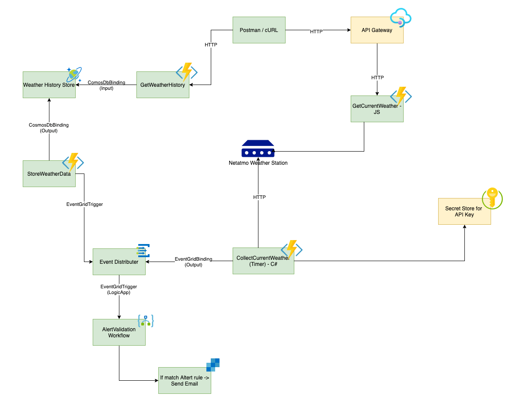

# Challenge 5 - Secure your Azure Functions with Azure KeyVaults & API Management

In the last exercises, you successfully built a solution based on Microsoft Azure Serverless Services. However, sensitive information is stored directly in the AppSettings of the functions and can therefore be viewed by everyone.

The goal of this exercise is to protect sensitive data and to provide it only to authorized persons & applications. We will realize this with the help of the Azure KeyVault. We will also look at how you can protect and control your Azure functions with HTTP triggers using the Azure API Management.

## ⚠️ Challenge

- Create an Azure Key Vault
- Store sensitive information in the Azure Key Vault
- Integrate Azure Key Vault into your Timer Function
- Create an API Management Service
- Protect your `GetCurrentWeather` function through API management

## 💡 Success Criteria

Your sensitive data is stored in a central location that only authorized applications and users have access to. Your Azure Functions with HTTP triggers are protected by API management.

## ℹ️ References

- [Accessing Azure Key Vault from Azure Functions](https://www.middleway.eu/accessing-azure-key-vault-from-azure-function/)
- [Import an Azure Function App as an API in Azure API Management](https://docs.microsoft.com/en-us/azure/api-management/import-function-app-as-api)
